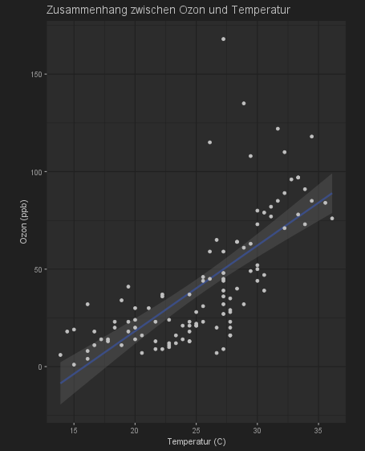

# Aufgabe/Abgabe zu Kursmaterial 7
Arvo Klöck  
11.12.2024

## Code
```r
# Funktion zum Installieren und Laden von Paketen
install_and_load <- function(package) {
  if (!require(package, character.only = TRUE)) {
    install.packages(package, dependencies = TRUE)
    library(package, character.only = TRUE)
  }
}

# Benötigte Pakete installieren und laden
packages <- c("ggplot2", "moments", "lmtest", "robustbase", "datasets")
lapply(packages, install_and_load)

# Originaldatensatz laden
airquality_dt <- datasets::airquality

# Umrechnungen: Temperatur in Grad Celsius und Wind in km/h
airquality_dt$Temp_C <- (airquality_dt$Temp - 32) * 5 / 9
airquality_dt$Wind_kmh <- airquality_dt$Wind * 1.60934

# Daten vorbereiten: Entfernung von NA-Werten
airquality_dt <- na.omit(airquality_dt)

# Regression: Zusammenhang zwischen Ozon und Temperatur in °C
modell <- lm(Ozone ~ Temp_C, data = airquality_dt)

# Übersicht der Koeffizienten
coefficients <- modell$coefficients
print(coefficients)

# Analyse der Werte
Analyse <- data.frame(org = airquality_dt$Ozone)
Analyse$var <- Analyse$org - mean(airquality_dt$Ozone)
Analyse$reg_fkt <- modell$coefficients[2] * airquality_dt$Temp_C + modell$coefficients[1]
Analyse$delta_reg <- Analyse$reg_fkt - mean(airquality_dt$Ozone)
Analyse$test <- abs(Analyse$org - Analyse$reg_fkt) < abs(Analyse$org - mean(airquality_dt$Ozone))
Analyse$zaehler <- Analyse$delta_reg^2
Analyse$nenner <- Analyse$var^2

# Bestimmtheitsmaß berechnen
R2 <- sum(Analyse$zaehler) / sum(Analyse$nenner)
print(paste("Bestimmtheitsmaß (R²):", R2))

# Residuen berechnen
Analyse$resid <- Analyse$org - Analyse$reg_fkt

# Zusammenfassung der Regression
summary_modell <- summary(modell)
print(summary_modell)

# Visualisierung der Regression
plot(
  airquality_dt$Temp_C,
  airquality_dt$Ozone,
  pch = 3, cex = 0.7, cex.lab = 1.2,
  xlab = "Temperatur (C)",
  ylab = "Ozon (ppb)"
)
# Regressionslinie
abline(lsfit(airquality_dt$Temp_C, airquality_dt$Ozone), lty = 1)
# Getrimmte Regression
abline(robustbase::ltsReg(airquality_dt$Temp_C, airquality_dt$Ozone), lty = 2)
# Legende
legend(
  "bottomright",
  legend = c("Robuste Linie, getrimmter Datensatz", "Regressionsfkt."),
  lty = c(2, 1)
)

# ggplot2-Variante
ggplot(data = airquality_dt, aes(Temp_C, Ozone)) +
  geom_smooth(method = 'lm') +
  geom_point(na.rm = TRUE) +
  labs(
    title = "Zusammenhang zwischen Ozon und Temperatur",
    x = "Temperatur (C)",
    y = "Ozon (ppb)"
  ) +
  coord_fixed(ratio = sd(airquality_dt$Temp_C, na.rm = TRUE) /
                sd(airquality_dt$Ozone, na.rm = TRUE))
```

## Ergebnisse:

```
Residuals:
    Min      1Q  Median      3Q     Max 
-40.922 -17.459  -0.874  10.444 118.078 

Coefficients:
            Estimate Std. Error t value Pr(>|t|)    
(Intercept) -69.5946    11.1918  -6.218 9.47e-09 ***
Temp_C        4.3904     0.4308  10.192  < 2e-16 ***

Signif. codes:  0 ‘***’ 0.001 ‘**’ 0.01 ‘*’ 0.05 ‘.’ 0.1 ‘ ’ 1

Residual standard error: 23.92 on 109 degrees of freedom
Multiple R-squared:  0.488,	Adjusted R-squared:  0.4833 
F-statistic: 103.9 on 1 and 109 DF,  p-value: < 2.2e-16
```



## Interpretation:
Die durchgeführte Regressionsanalyse untersucht den Zusammenhang zwischen der Temperatur und dem Ozongehalt in der Luft. Die Ergebnisse:

- Positiver Zusammenhang: Höhere Temperaturen sind mit höheren Ozonwerten verbunden. Das bedeutet, dass wenn die Temperatur steigt, in der Regel auch der Ozongehalt in der Luft zunimmt. 
- Statistische Signifikanz: Der Zusammenhang ist statistisch signifikant, was bedeutet, dass er nicht zufällig entstanden ist. Es besteht also eine echte Beziehung zwischen Temperatur und Ozon. 
- Varianz: Ungefähr 48,8% der Schwankungen im Ozongehalt können durch Schwankungen in der Temperatur erklärt werden. Das ist ein moderater Zusammenhang, was bedeutet, dass auch andere Faktoren eine Rolle spielen. 
- Ausreißer: Es gibt einige Messwerte (Ausreißer), die nicht gut in das allgemeine Muster passen. Das könnte bedeuten, dass es noch andere Faktoren gibt, die den Ozongehalt beeinflussen, oder dass es bei diesen Messungen besondere Umstände gegeben hat.

## Kritische Betrachtung

Korrelation vs. Kausalität: Die Analyse zeigt einen Zusammenhang, aber nicht unbedingt einen kausalen Zusammenhang. Es könnte sein, dass ein dritter Faktor sowohl die Temperatur als auch den Ozongehalt beeinflusst.
Extrapolation: Die Ergebnisse gelten nur für den untersuchten Temperaturbereich. Für extrem hohe oder niedrige Temperaturen können die Ergebnisse nicht verallgemeinert werden.

Die Regressionsanalyse zeigt einen klaren Zusammenhang zwischen Temperatur und Ozongehalt.
